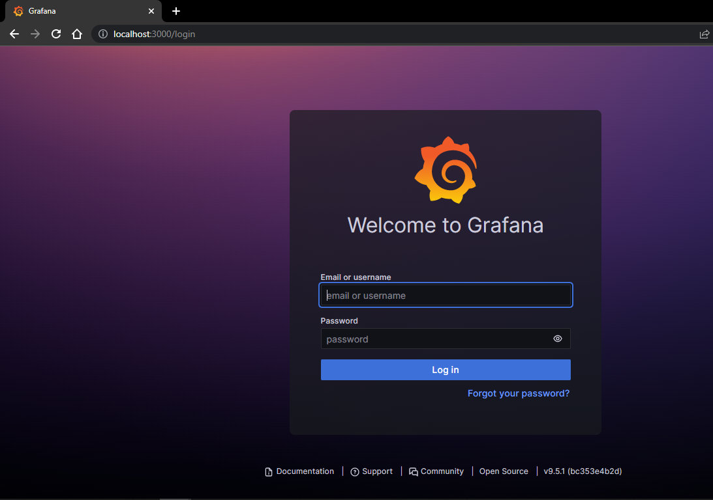
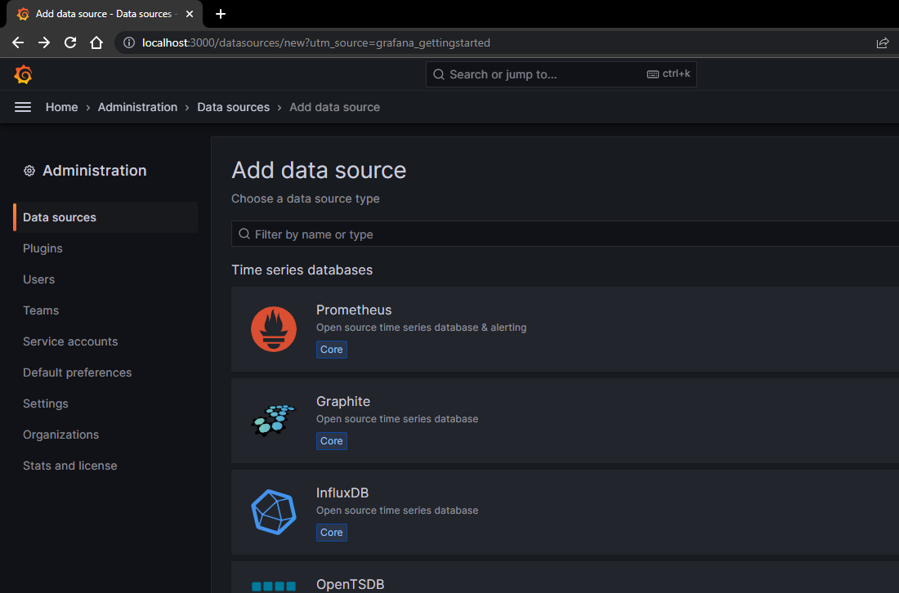
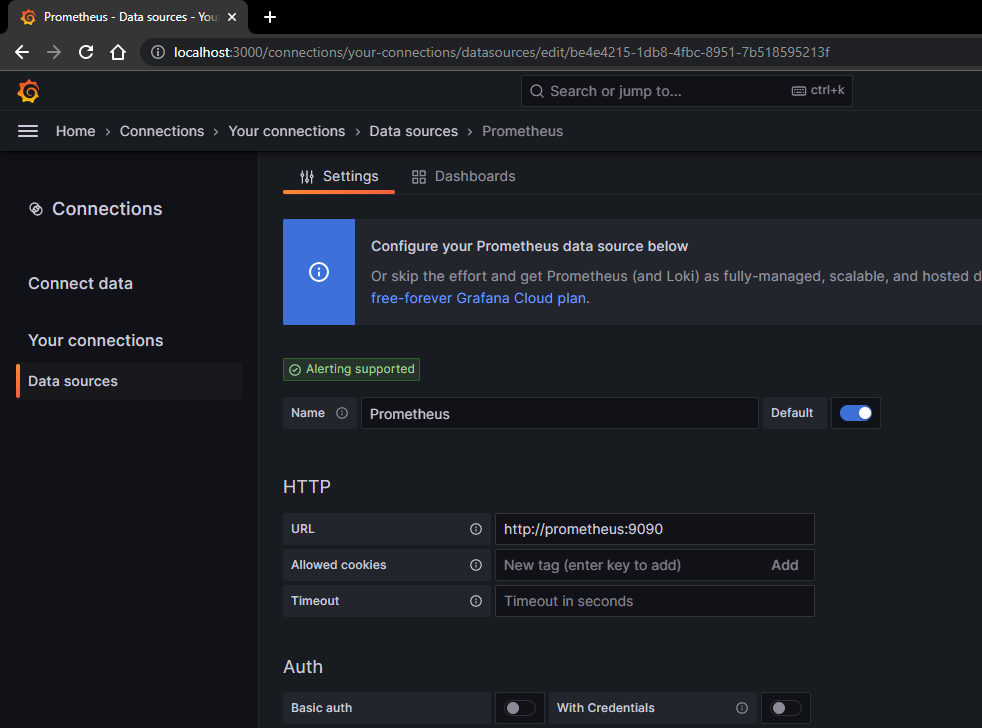
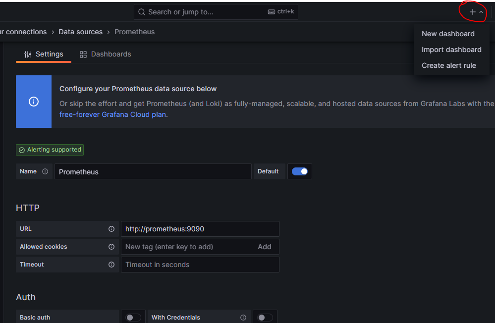
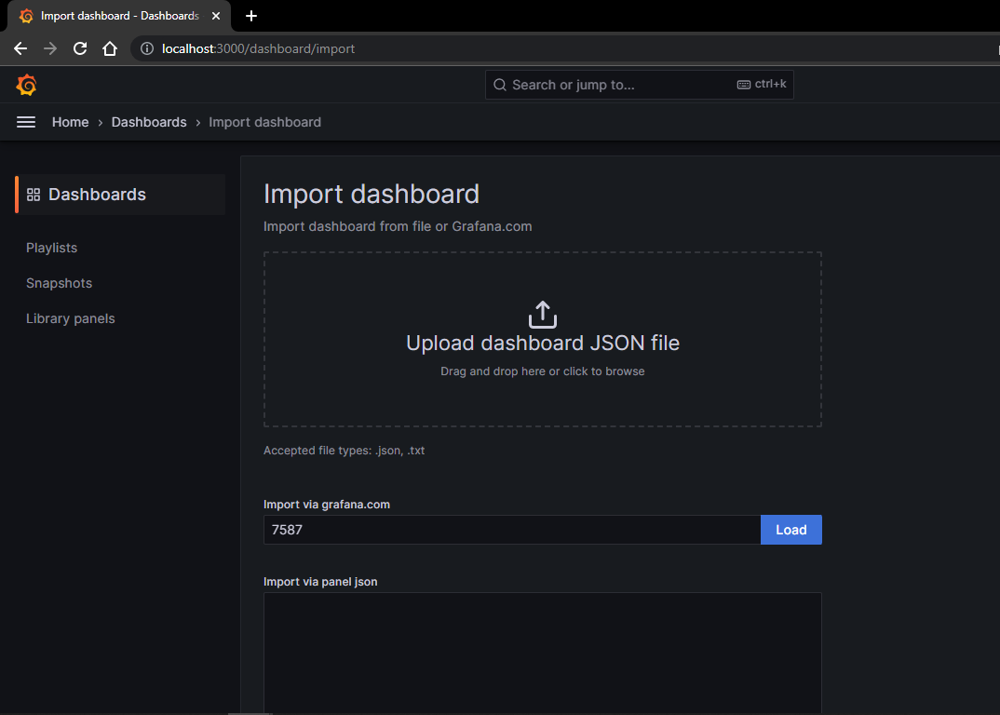
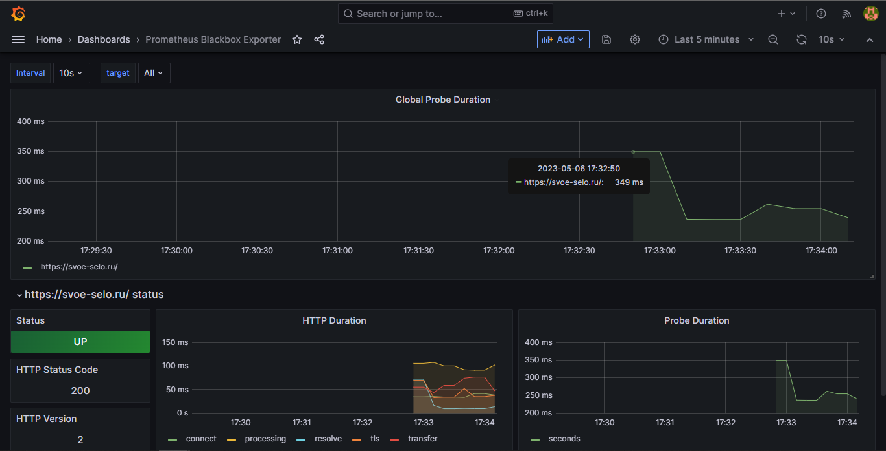

# svoe_selo_scraping

### To start the services

```
$ git clone https://github.com/DanilAkm/svoe_selo_scraping.git

$ cd svoe_selo_scraping

$ docker-compose up
```

---

Enter <http://localhost:3000> to access Grafana



---

- Default login & passwd: <b>admin</b>

Add prometheus as a data source in the Administration panel



---

Prometheus service should be available on <http://prometheus:9090>



---

You then need to create or import a dashboard



---

e.g. this: <https://grafana.com/grafana/dashboards/7587-prometheus-blackbox-exporter/>



---

And here we have it


